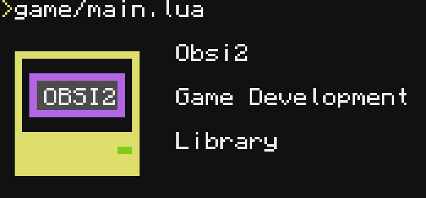

# Obsi 2 - Lua library for 2D game development.



Obsi 2 is a Lua library that was designed specifically for CC:Tweaked. Originally it was made as a game engine, but I have refactored it into a library for easier packaging.

Improvements in Obsi 2:
* More optimized `obsi.graphics.rectangle` function
* New `obsi.graphics.getPalette` function! (Yes, it didn't exist before. Also be aware that it creates a new table on every call. Sorry.)
* FPS counter that is accessible with `obsi.timer.getFPS()`
* Module `obsi.filesystem` was renamed to `obsi.fs`, and module `obsi.time` to `obsi.timer`
* Rendering APIs `hmon` and `parea` were renamed to `basic` and `neat`
* File extensions are mostly ignored (This is useful for when you have a system for converting `nfp` files to `orli` files, but don't want to bother with renaming every file in code)
* Fixed a crash when the game would play noteblock music in Minecraft
* Licenses from used projects are moved to `LICENSES` folder
* Some other changes that I forgot about

## Switching from Obsi to Obsi 2:
There are a few things to look out for when switching to Obsi 2:

1. Now you have to include `obsi2` as a library
2. In order for your code to be ran in the loop, you have to put `obsi.init()` at the end of your main file
3. Replace any mentions of `obsi.filesystem` with `obsi.fs` and `obsi.time` with `obsi.timer` 
4. Move the code from `config.lua` file (it is no longer used by obsi) to the config inside `obsi2/init.lua`
5. Replace any mentions of `hmon` and `parea` rendering apis to `basic` and `neat` respectively
6. If the code outside of your `main.lua` file is also using `obsi`, then require it there as well. (Don't worry, `require` caches any of the packages it loads.)

Code with Obsi:
```lua
local img

function obsi.load()
	img = obsi.graphics.newImage("coolimg.nfp")
end

function obsi.draw()
	obsi.graphics.draw(img, 1, 1)
end
```

Same code with Obsi 2:
```lua
local obsi = require("obsi2")

local img

function obsi.load()
	img = obsi.graphics.newImage("coolimg.nfp")
end

function obsi.draw()
	obsi.graphics.draw(img, 1, 1)
end

obsi.init()
```

Credits:

[9551-Dev](https://github.com/9551-Dev) - For the Pixelbox rendering API.

[Xella37](https://github.com/Xella37) - For the original parsing function for NBS file format.